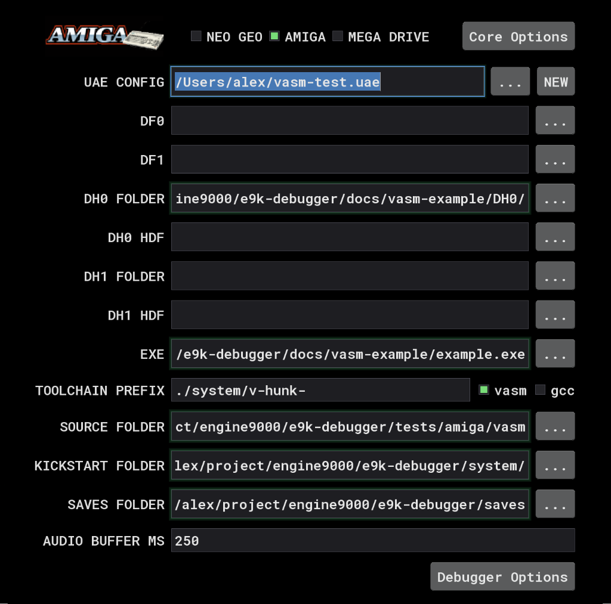
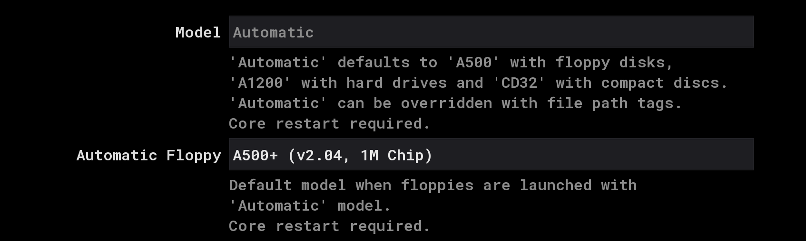
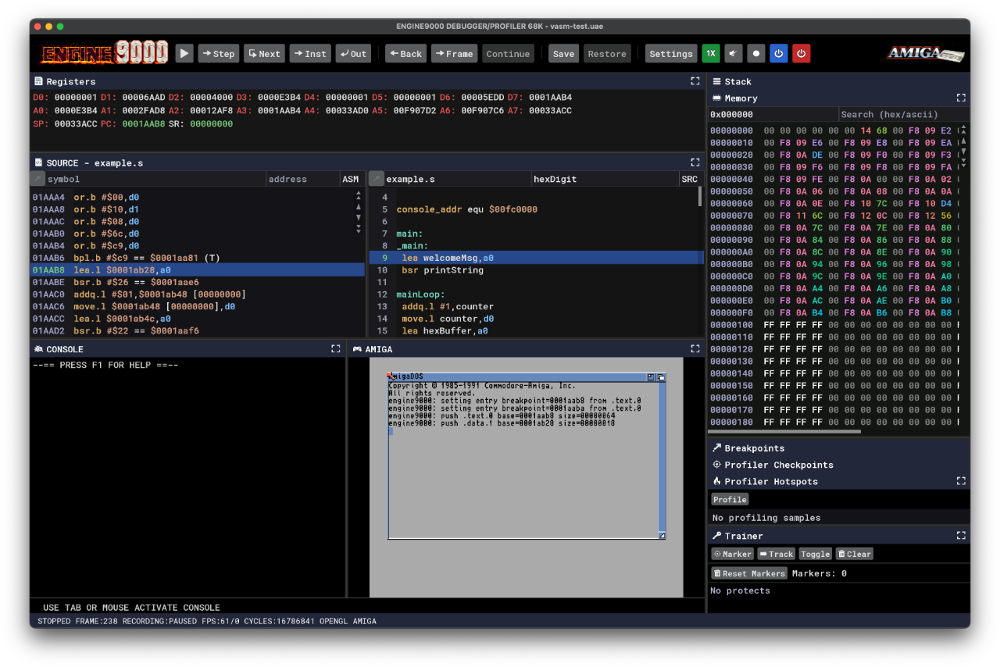

# Basic source level debugging with VASM

## Configure debugger

Firstly configure the debugger:

 - **UAE Config** - create a new UAE config - this does not need futher adjustment
 - **DH0 Folder** - select the docs/vasm-example/DH0/ folder - this will be the Amiga HD we use:

     `/Users/user/e9k-debugger/docs/vasm-example/DH0/`
 - **EXE** - must point to the Amiga hunk executable with debug info - for this example this is:

     `/Users/user/e9k-debugger/docs/vasm-example/example_syms.exe`
 - **Toolchain Prefex** - select `vasm`
 - **Source Folder** - in our example this is:

    `/Users/user/e9k-debugger/docs/vasm-example/`

 
 
## Configure core options

Currently load9000 which we will use to launch our exe requires 2.04 so select a 2.04 setup
(This will be fixed soon!)

- Automatic Floppy
`A500+ (v2.04, 1M chip)`

 
 
 ## Review Startup-Sequence
 
 We launch our example exe on the Amiga HD via the `Startup-sequence` in `docs/vasm-example/DH0/S`
 
 `load9000 --break example_run.exe`
 
 If we don't want to break on startup, we can remove `--break`
 
 ## Start debugger
 
 The debugger should now start and break at the entry point to our example program
 
 

Selecting `SRC` in the source pane should now show vasm level source code.
